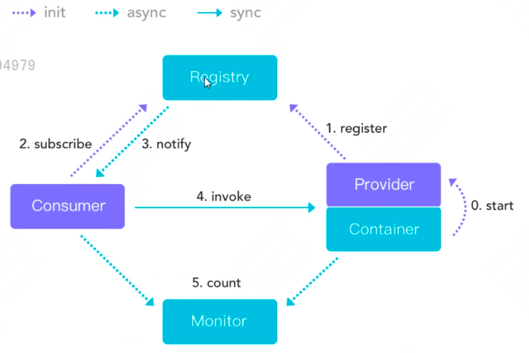

# 章节1 Dubbo简介
Apache Dubbo是一个高可用的, 基于java的开源RPCk框架。

Dubbo框架不仅仅具备RPC访问功能, 还包含服务治理功能。

##### 发展历史
Dubbo最开始是阿里内部使用的rpc框架, 2011年对外提供, 2012年停止更新, 2017年开始继续更新, 2019年捐献给Apache 由Apache维护2.7以上版本


# 章节2 Dubbo架构讲解
##### Dubbo架构图:



- Provider: 服务提供者
- Consumer: 服务消费者
- Container: 容器(Spring容器), Dubbo完全基于Spring实现 (spring版本要和dubbo版本兼容)
- Registry: 注册中心, 存放Provider的ip,访问端口,访问遵守的协议等信息
- Monitor: 监控中心, 监控Provider的压力情况等信息。每隔两分钟Consumer和Provider会把调用次数发送给Monitor, 由Monitor进行统计

##### 执行流程:
0. start: 启动服务时, Spring容器会记载dubbo相关bean
1. register: 服务初始化时, 把服务提供者的相关信息注册到注册中心中
2. subscribe/notify: 服务消费者从registry中获得服务提供者的信息
3. invoke: consumer根据从registry中获得的服务提供者的信息 调用provider中的方法
4. count: consuemr和provider把调用次数异步发送给monitor进行统计

# 章节3 Dubbo支持的协议
1. Dubbo协议(官方推荐协议) <br/>
- 优点: 采用nio, 复用单一长连接, 并使用线程池并发处理请求。减少连接建立的三次握手次数 加大并发请求处理效率 性能较好
- 缺点: 大文件上传时 可能出现问题(但是一般也不使用dubbo进行大文件上传)

2. RMI(Remote Method Invocation)协议
- 优点: jdk自带的能力
- 缺点: 偶尔会连接失败

3. Hessian协议
- 优点: 可与原生的Hessian互相操作, 是基于的http协议
- 缺点: 需要hessian.jar支持, http短连接 开销大, 性能没有dubbo协议好

# 章节4 Dubbo支持的注册中心
1. Zookeeper(官方推荐)
- 优点: 支持分布式的很多周边产品
- 缺点: 受限于zookeeper的稳定性(但是zookeeper的稳定性比较好)

2. Multicast
- 优点: 去中心化, 不需要单独安装软件
- 缺点: provider、consumer、registry只能在同一个局域网中 在广域网中不能使用, 不能跨机房路由

3. Redis
- 优点: 支持集群, 性能高
- 缺点: 需要对redis进行一些配置(比如时间同步)

# 章节5 第一个Dubbo项目-parent工程的编写
配置父项目的pom.xml

```xml
<project xmlns="http://maven.apache.org/POM/4.0.0" xmlns:xsi="http://www.w3.org/2001/XMLSchema-instance"
  xsi:schemaLocation="http://maven.apache.org/POM/4.0.0 http://maven.apache.org/maven-v4_0_0.xsd">
  <modelVersion>4.0.0</modelVersion>
  <groupId>org.zy</groupId>
  <artifactId>Dubbo</artifactId>
  <version>1.0-SNAPSHOT</version>
  <name>Archetype - Dubbo</name>
  <url>http://maven.apache.org</url>

  <parent>
    <groupId>org.springframework.boot</groupId>
    <artifactId>spring-boot-starter-parent</artifactId>
    <version>2.1.10.RELEASE</version>
  </parent>

  <properties>
    <spring-boot-starter.version>2.1.10.RELEASE</spring-boot-starter.version>
  </properties>
  <dependencyManagement>
    <dependencies>
      <dependency>
        <groupId>org.springframework.boot</groupId>
        <artifactId>spring-boot-starter</artifactId>
        <version>${spring-boot-starter.version}</version>
      </dependency>
      <dependency>
        <groupId>org.springframework.boot</groupId>
        <artifactId>spring-boot-starter-web</artifactId>
        <version>2.1.0.RELEASE</version>
      </dependency>
      <dependency>
        <groupId>org.apache.dubbo</groupId>
        <artifactId>dubbo-spring-boot-starter</artifactId>
        <version>2.7.3</version>
      </dependency>
      <!--内嵌zookeeper-->
      <dependency>
        <groupId>org.apache.curator</groupId>
        <artifactId>curator-recipes</artifactId>
        <version>4.2.0</version>
      </dependency>
      <dependency>
        <groupId>org.apache.curator</groupId>
        <artifactId>curator-framework</artifactId>
        <version>4.2.0</version>
      </dependency>
    </dependencies>
  </dependencyManagement>
</project>

```

# 章节6 第一个Dubbo项目-接口&Provider编写
创建api模块 新建 -> DemoDubboService接口

新建provider模块 新建 -> DemoDubboServiceImpl实现类:

```java
package demo.service;/**
 * @Author:zhoayu
 * @Date:2024/10/29 12:33
 * @Description:demo.service
 * @version:1.0
 */


import org.apache.dubbo.config.annotation.Service;

/**
 * @ClassName DemoDubboServiceImpl
 * @Description //TODO 
 * @Author zhaoyu
 * @Date 2024/10/29
 */
// 注意这里的@Service注解要使用org.apache.dubbo.config.annotation.Service, 否则dubbo会认为这是一个consumer 不是一个provider
// 标识有dubbo的@Service的bean中的方法就会被注册到registry中
@Service
public class DemoDubboServiceImpl implements DemoDubboService {

    @Override
    public String demo(String param) {
        System.out.println("demo方法执行了");
        return param + "demo123";
    }
}

```

provider模块的启动类ProviderApplicatio:

```java
package demo; /**
 * @Author:zhoayu
 * @Date:2024/10/29 12:36
 * @Description:PACKAGE_NAME
 * @version:1.0
 */

import org.apache.dubbo.config.spring.context.annotation.EnableDubbo;
import org.springframework.boot.SpringApplication;
import org.springframework.boot.autoconfigure.SpringBootApplication;

/**
 * @ClassName demo.ProviderApplication
 * @Description //TODO 
 * @Author zhaoyu
 * @Date 2024/10/29
 */
@SpringBootApplication
@EnableDubbo
public class ProviderApplication {
    public static void main(String[] args) {
        SpringApplication.run(ProviderApplication.class, args);
    }
}
```

# 章节7 第一个Dubbo项目-Consumer编写


